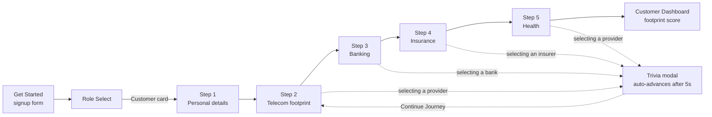
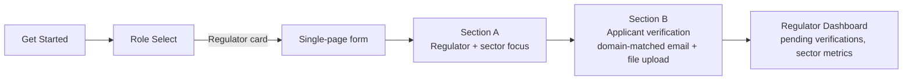
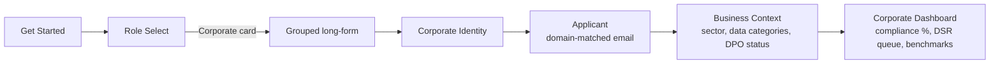

# DPO Trust — Onboarding UX Reference & Architecture Notes

*Reverse-engineered from a supplied single-file React prototype ("DPO Trust", Tailwind +
custom CSS-variable theming, in-memory state machine, no backend). Kept as a **documentation-only**
reference — see [Scope](#0-scope--why-this-is-docs-only) before treating anything here as a build
plan.*

## 0. Scope — why this is docs-only

This file is analysis and recommendations, not an implementation. Two reasons:

1. **The prototype is a wireframe, not Kuwana.** It's useful because its persona split
   (Customer / Regulator / Corporate) maps almost exactly onto three of Kuwana's real portals, and
   because its onboarding UX is considerably more built-out than what those three portals have
   today — but it's a different app (a Zimbabwe *data-protection compliance* tool, not a
   decision-intelligence/comparison platform) and none of its copy, scoring model, or trivia
   content is Kuwana's.
2. **Admin is explicitly out of scope here.** HANDOFF.md's "Admin — solid but not complete"
   section and the admin dashboard/handoff report are being worked on separately. Nothing below
   touches `/admin`, `AdminAuditLog`, or `HANDOFF.md` itself — the recommendations in §6 are
   scoped to Corporate/Regulator onboarding specifically because that's the gap HANDOFF.md already
   flags as unowned ("Corporate/Regulator — intentionally left thin"), not because it overlaps
   with the admin work.

## 1. What the prototype is

DPO Trust is a Zimbabwe-focused data-protection compliance platform serving three distinct audiences from one codebase:

| User type | Goal | Verification requirement |
| --- | --- | --- |
| **Customer** | Understand and manage their personal data footprint across telecom, banking, insurance, health | None — self-serve signup |
| **Regulator** | Monitor sector-wide compliance, review applicant/corporate submissions | Government/public-domain email (`.gov.zw`, `.co.zw`) matched against a regulator list (POTRAZ, RBZ, IPEC, SECZIM, ZERA) |
| **Corporate** | Manage their organization's compliance posture, DPO declarations, data-subject requests | Corporate email domain matching the company name |

The whole app is one big component (`Li`) driving a **string-based view switch** (`getStarted → roleSelect → {customer,regulator,corporate}Flow → {customer,regulator,corporate}Dashboard`), with local `useState` for every field. There is no router, no backend calls, and no persistence — it's a clickable wireframe.

---

## 2. User experience by persona

### 2.1 Shared entry point

Every user starts on the same **Get Started** screen: a marketing/value-prop column on the left (with a hero tab switcher for Individuals / Regulators / Corporates) and a signup form on the right (name, email, password, confirm, ToS checkbox, Google SSO placeholder). Submitting routes everyone to the same **Role Select** screen, where they pick one of the three cards above — this is the fork point for everything that follows.

### 2.2 Customer journey — 5-step wizard



Notable UX mechanics:

- **Progressive disclosure per step** — selecting a telecom/bank/insurer/health-provider card reveals inline sub-fields (contract type, tenure) only for the selected option, keeping the form short until it's needed.
- **"Did you know?" trivia modal** — every time a real provider is chosen, a themed fact fires (auto-advancing progress bar, 5s timeout, dismiss/continue options). This is a delight/education layer that also disguises the lack of a real backend call. **See §4 — this specific mechanic cannot be ported as-is into Kuwana.**
- **Stepper header** persists across all 5 steps with completed/current/upcoming states, so users always know where they are and can't skip ahead.
- Ends on a **Dashboard** with an overall "Footprint Score" (0–100), per-sector risk badges (High/Medium/Low), and a breakdown card per sector.

### 2.3 Regulator journey — single verification form



Key UX difference from the customer flow: **no multi-step wizard** — it's one scrollable form split into two visually grouped sections, because the regulator persona needs fewer, denser fields rather than a guided sequence. Real-time email validation gives inline ✓/✗ feedback against the selected regulator's expected domain, with a side panel documenting the exact validation rule (useful for developer handoff, less so for end users — a production build should hide this).

### 2.4 Corporate journey — long grouped form



This is the densest onboarding: it uses a two-column layout with a **live "Compliance Preview" completion meter and checklist** in the right rail, so the applicant sees progress accumulate as they fill in the (rather long) left-column form — a pattern worth keeping since corporate onboarding forms are usually where users drop off.

### 2.5 Cross-cutting UX elements

- **Dark/light theme toggle** in the sticky header, applied via a `dark` class on `<html>` and CSS custom properties (`hsl(var(--foreground))` etc.) — so theming is free for every component that already uses the variables. Also respects `prefers-color-scheme` as the default before user override, and fully disables the canvas particle/spotlight effects under `prefers-reduced-motion: reduce` — both worth keeping as patterns regardless of what else is ported.
- **Annotation mode** (`o` state) — an always-available "wireframe spec" overlay that labels sections, validation rules, and dimensions in red. Great for design review, must be stripped before production.
- **Toast notifications** for lightweight confirmations (e.g. "Google SSO — coming soon").
- **Restart prototype** button on every dashboard — purely a demo affordance.

---

## 3. Frontend architecture (as built)

```mermaid
flowchart TB
    subgraph Bundle["Single HTML bundle"]
        RD[React 18 + ReactDOM\nvendored/bundled inline]
        TW[Tailwind v3 utility CSS\ncompiled ahead of time]
        APP[App component: Li()]
    end

    APP --> VS["View state\nuseState('getStarted' | 'roleSelect' | '...Flow' | '...Dashboard')"]
    APP --> FS[Form field state\n~20 individual useState hooks]
    APP --> MODAL[Trivia modal state\nvisible / loading / progress / autoplay timers]
    APP --> THEME[Theme state\ndark/light -> documentElement.classList]

    APP --> UI1[Reusable primitives\nIe = labeled Input\nYe = labeled Select\nPi = Section wrapper]
    APP --> DATA[Static data\nEr = regulator domain list\nKe = trivia fact bank by sector/company]

    VS --> Views["View components (inline JSX blocks, not separate files)\ngetStarted / roleSelect / customerFlow / regulatorFlow / corporateFlow / *Dashboard"]
```

Observed characteristics:

1. **No routing library.** Navigation is a single `useState<string>` swapped by `onClick` handlers — meaning no deep links, no back-button support, no shareable URLs per step.
2. **No component decomposition beyond three tiny primitives** (`Ie`, `Ye`, `Pi`). Every view (get-started, role-select, 3 onboarding flows, 3 dashboards) is a JSX block inside one function, making the file large and hard to test in isolation.
3. **State is entirely local and untyped** — plain `useState`, no context, no reducer, no form library (no Formik/React Hook Form/Zod). Validation (email-domain matching, password rules) is done ad hoc with string methods inside the component.
4. **Styling** is Tailwind utility classes plus a parallel system of inline `style={{ background: 'hsl(var(--...))' }}` calls reading CSS custom properties — effectively a manual design-token layer bolted onto Tailwind, which is unusual and worth formalizing (see §5).
5. **No backend integration** — "submit" actions just switch view state; the trivia modal and progress bars are the only asynchronous-feeling behavior, driven by `setTimeout`/`setInterval`.
6. Background canvas effects (`resizeParticles`, `drawParticles`, card "ignition" glow tracking) run as raw DOM/canvas scripts outside React, bolted onto the page for visual flourish.

---

## 4. Compatibility check — what NOT to port into Kuwana

This section exists because one prototype mechanic looks superficially reusable but directly
violates a hard constraint already established for this project.

### 4.1 The trivia modal's fact bank is fabricated statistics

The `Ke` object (`Ke.telecoms.Econet`, `Ke.banking.CBZ`, etc.) hardcodes lines like *"Econet was
founded in July 1998... 28 years of connecting Zimbabwe"*, *"EcoCash — now used by over 12M
Zimbabweans, processing billions monthly"*, *"Old Mutual Zimbabwe manages over $1B in funeral and
life cover assets"*. These read as sourced facts but are invented plausible-sounding numbers with
no citation, generated to fill a "Did you know?" UI slot.

Kuwana's own core thesis — stated in the AI4I Grand Challenge proposal this project traces
back to, and reinforced in this session's working conventions — is explicit: **no invented
statistics anywhere, including onboarding copy/trivia, not just computed scores.** Every
"illustrative" number already in the Kuwana catalog is disclosed as mock/seed data; anything
presented as fact must trace to a real source. The DPO Trust trivia mechanic is exactly the failure
mode that rule exists to prevent.

**What's safe to keep**: the *mechanic* — an educational modal that fires on a meaningful user
action, with an auto-advancing timer and a dismiss/continue choice. **What's not safe to keep**:
the *content*. If Kuwana ever wants an equivalent "did you know" moment during Corporate/Regulator
onboarding (e.g. surfacing a real POTRAZ/RBZ regulatory requirement, or a real stat from Kuwana's
own seeded catalog data), the fact bank has to be sourced and re-verified per §4 of the working
conventions, not adapted from this prototype's copy.

### 4.2 Everything else ports cleanly

The rest of the prototype (stepper mechanics, progressive disclosure, domain-verified email
validation, the compliance-preview completion meter, dark/light theming via CSS custom properties,
reduced-motion handling) is UI/interaction pattern only — no factual claims embedded — and is
covered in §6 below.

---

## 5. Formalize the design-token pattern (applies regardless of persona work)

The prototype's `hsl(var(--primary))`-style inline styling is a real pattern worth naming
explicitly rather than copying ad hoc: a token layer (`--background`, `--foreground`, `--primary`,
`--border`, etc.) declared once in `:root` and again under `.dark`/`prefers-color-scheme: dark`,
then referenced everywhere via `hsl(var(--x))` so no component hardcodes a color. Kuwana's
`globals.css` already does something in this spirit (sky/teal/coral palette, per HANDOFF.md's
"three disagreeing color palettes" note) — if any of the work below touches shared UI primitives,
extend the *existing* token set rather than introducing a second one, to avoid adding a fourth
disagreeing palette to the pile HANDOFF.md already flags as unresolved.

---

## 6. Where this actually applies in Kuwana today

**Update, verified against the live repo (not HANDOFF.md's text, which is stale on this one
point):** Corporate/Regulator self-serve onboarding — the exact gap this section originally
analyzed — has since been built, independently of this document, in
`feat: implement server-side checks for Corporate/Regulator self-registration; enhance onboarding
schema and tests` (and a preceding `fix: close role self-escalation vulnerability in public signup
endpoint`). HANDOFF.md's "Corporate/Regulator — intentionally left thin" section still says
"both roles only reachable via `/admin/users`, no invite-flow UI" — that's no longer accurate, but
fixing HANDOFF.md's text is left to whoever owns that document, per §0.

What's actually there, mapped against what this section originally recommended:

| Recommendation this doc made | Real implementation |
| --- | --- |
| Get Started → Role Select fork, persona-specific fields deferred until after account creation | `src/app/signup/page.tsx` — a single-page state machine (`role → account → orgDetails → consent → processing`) with a 4-card role picker (Consumer/Corporate/Provider/Regulator) matching this prototype's shape closely, icons and all. |
| A small `{label, domain}[]` regulator table + a pure domain-match function | `src/lib/orgVerification.ts` — `REGULATORS` (POTRAZ/RBZ/IPEC, each with a verified `.gov.zw`/`.co.zw` domain) + `emailMatchesRegulator()`. Corporate gets the mirror-image check, `isPersonalEmailDomain()` against a personal-email-provider denylist. |
| Zod for the validation schema (already a dependency, no new one needed) | `src/lib/onboardingSchema.ts`, covered by `src/lib/onboardingSchema.test.ts`. |
| — (this doc didn't anticipate it, but it's the right call) | **The verification boundary lives server-side in `src/app/api/onboarding/route.ts`, keyed off the authenticated Supabase session email — never the client-supplied role.** This is stronger than what DPO Trust's prototype does (its domain check is client-side only, informational) and closes a real vulnerability class: the commit history shows this was already exploited-and-fixed once (role self-escalation via the public signup endpoint), which is exactly the kind of gap a client-only version of this check would reopen. |

React Hook Form / TanStack Query are still not installed, and the existing implementation doesn't
need them — confirms the "don't add speculatively" call in the earlier version of this section was
right.

**One residual, smaller version of the §4 issue remains**: `src/lib/onboarding-facts.ts` (the
"saving your profile…" screen's fact queue — this codebase's answer to DPO Trust's trivia modal,
and a much better one, since it's provider-personalized rather than generic) still asserts specific
unsourced founding years and scale claims as fact (*"CBZ Bank traces back to 1980"*, *"Old Mutual
has operated in Zimbabwe since 1902, over 120 years"*). A prior commit (`fix: correct inaccurate/
unverified claims in onboarding trivia facts`) already removed the worst offenders (e.g. a specific
invented user-count for EcoCash), so this has real attention on it already — flagged here only
because `src/app/trust/page.tsx` makes "we don't invent statistics... including the small stuff,
like onboarding tips" a public promise, and a few of these dates/figures still read as claims
without a citable source. Not fixed unilaterally in this pass — it's copy content, not a doc or
architecture question, and belongs to whoever owns `onboarding-facts.ts` next.

---

## 7. Accessibility gap-check (WCAG 2.1 AA is a hard requirement, per the AI4I proposal)

The prototype was never built against this bar, so treat it as a UX-pattern reference only, not an
accessibility reference. Specific gaps observed, relevant if any of its patterns get adapted:

- **Role-select cards** (`t===h.id` selection state) communicate "selected" via border color +
  background tint + a checkmark icon — the icon means selection state isn't color-only, which is
  good, but there's no `aria-pressed`/`role="radio"` semantics on the card buttons; a screen-reader
  user gets "button" with no indication of the selected/unselected state.
  Risk badges (High/Medium/Low) on the customer dashboard are color-coded but always paired with
  the text label itself, which is the right pattern to keep.
- **The trivia modal** traps focus visually (backdrop blur) but the implementation has no visible
  `role="dialog"`, `aria-modal`, or focus-trap/return-focus handling — a real dialog needs all
  three, plus Escape-to-dismiss.
- **The stepper header** conveys step state via background color + a small badge; no
  `aria-current="step"` equivalent. Cheap to add if the stepper pattern itself gets reused.
- **Positive pattern already present and worth keeping as-is**: `prefers-reduced-motion: reduce`
  fully disables the particle canvas, spotlight, and card-tilt animation, and the theme toggle
  respects `prefers-color-scheme` before any user override.

---

## 8. Non-goals of this document

To keep this from expanding scope beyond what was asked:

- No code in this repo has been changed to act on any of the above.
- No claim is made about the Admin portal, `AdminAuditLog`, or `HANDOFF.md`'s "Admin — solid but
  not complete" section — that work is owned elsewhere and this document does not touch it.
- No timeline or priority is assigned to Corporate/Regulator self-serve onboarding; that remains a
  product decision per HANDOFF.md's existing "don't just pick one — ask" framing for undecided
  scope.
