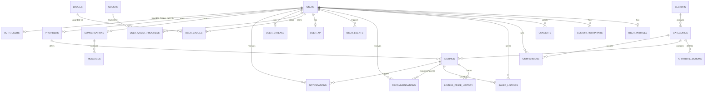

# Kuwana database architecture

30 tables, standard Postgres for all of them, plus two small Supabase-only
triggers on the `users` table (see below). The DDL lives in
[`schema.sql`](./schema.sql) in this same folder — paste-able as-is into a
fresh Supabase project today, or a plain Postgres/RDS/Neon instance later
(minus the trigger section). See that file's header comment for exact run
instructions and how it's kept in sync with `prisma/schema.prisma` (the
versioned source of truth for every table — this file mirrors it, verified
against the live database on 2026-08-06).

## Why this is portable

Checked directly against the live Supabase project's `pg_indexes`,
`pg_policies`, `information_schema.routines`, and `pg_extension`:

- **No Row Level Security** — every table has RLS off, no policies exist.
  Authorization is enforced in the Next.js API layer (Prisma connects with
  the DB's own credentials, not through Supabase's PostgREST/RLS path) —
  confirmed no code anywhere calls `supabase.from()`/`.rpc()`, so RLS being
  off isn't a live gap, just something with no DB-level backstop if that
  ever changes.
- **No views.**
- **No Supabase-only extensions in use** — `pgcrypto`, `uuid-ossp`, and
  `plpgsql` are standard Postgres; `pg_stat_statements` is a generic
  monitoring extension most managed Postgres providers ship; `supabase_vault`
  is present but no table/column here depends on it.
- **Two triggers + two functions, Supabase-only, and real** — `public.users`
  is now tied to Supabase's own `auth.users`: writes to `users.id` are
  rejected unless a matching Auth user exists, and deleting the Auth user
  (e.g. via the dashboard) cascades to the app-side row and everything that
  already `ON DELETE CASCADE`s from it. Added 2026-08-06 as a trigger pair
  rather than a native FK — `auth.users.id` is Postgres `uuid` and
  `public.users.id` is `TEXT` (Prisma's `@default(uuid())` convention), and
  Postgres refuses a FK across incompatible types outright. This is the one
  non-portable piece — skip that final section of `schema.sql` on
  non-Supabase Postgres, everything else is unaffected.

## Table groups

| Domain | Tables |
| --- | --- |
| Identity & onboarding | `users`, `user_profiles`, `sector_footprints`, `consents` |
| Sector catalog (schema-driven) | `sectors`, `categories`, `attribute_schema`, `providers`, `listings`, `listing_price_history` |
| User activity | `comparisons`, `saved_listings`, `recommendations`, `recommendation_cache`, `notifications` |
| AI chat assistant | `conversations`, `messages` |
| Gamification | `user_events`, `gamification_rules`, `user_xp`, `badges`, `user_badges`, `quests`, `user_quest_progress`, `user_streaks` |
| Price/data intelligence | `social_price_mentions` (free social-media scanner, admin-reviewed), `fx_rates` (live currency rates) |
| Platform ops | `admin_audit_log`, `rate_limit_hits` |
| Standalone | `waitlist_signups` (healthcare "coming soon") |

`recommendation_cache` caches the AI recommendation output per distinct
listing-set (a pure function of the set, not the caller) so repeatedly
comparing the same few listings doesn't re-bill the model. It's separate
from `recommendations`, which stays the audit-grade per-user record and is
still written on every request regardless of cache hits.

## Entity relationships

`gamification_rules`, `recommendation_cache`, `social_price_mentions`,
`fx_rates`, `admin_audit_log`, `rate_limit_hits`, and `waitlist_signups`
have no foreign keys — each is a standalone reference/log table keyed on
its own natural or generated key. `admin_audit_log` in particular
deliberately has **no** FK to the rows it describes (a listing/provider/user
it references can be deleted; the log entry must survive that). `AUTH_USERS`
is Supabase's own table, shown here only to make the trigger relationship
visible — it isn't part of this app's schema.

## Two ways to stand this up

**Fresh Supabase project, no repo needed:** Supabase Dashboard → SQL Editor
→ paste `schema.sql` → Run. Then seed reference data (sectors, categories,
providers, listings, gamification rules) with
`DATABASE_URL="<connection string>" npm run db:seed` from this repo.

**From this repo, any Postgres target:** point `DATABASE_URL`/`DIRECT_URL`
at the target and run `npx prisma migrate deploy`, which replays
`prisma/migrations/*/migration.sql` — the actual versioned history. This is
the path to prefer once you're touching the schema again, since it keeps
history intact instead of collapsing it into one script.

Both paths produce an identical schema — confirmed via `prisma migrate diff`
showing zero difference between `prisma/schema.prisma` and the live
database, and by executing `schema.sql`'s table/index/FK portion end-to-end
in an isolated scratch schema on the live project (created all 30 tables,
then dropped) before this file was written. The trigger section was
verified separately: applied live, then behaviorally tested with a rolled-
back transaction confirming a `users` insert with no matching `auth.users`
row is correctly rejected.

## Auth email rate limit

`supabase.auth.signUp()` ([signup/page.tsx](../src/app/signup/page.tsx)) sends
its confirmation email through Supabase's built-in mailer unless a custom SMTP
provider is configured in the dashboard (Authentication → Emails → SMTP
Settings) — there's no `supabase/config.toml` or SMTP setup in this repo, so
today every project on this schema is on the default mailer. That default is
capped very low (a handful of emails/hour, shared across the whole project) and
returns the signup error surfaced verbatim on line 332 as "email rate limit
exceeded" once it's hit — this is Supabase's own GoTrue limit, not the app's
`src/lib/rateLimit.ts`, and repeated signup testing burns through it fast.

Before real users hit this, configure SMTP as above. Until then, either wait
out the window or turn off "Confirm email" under Authentication → Providers →
Email for dev/testing.

## When you rebuild on another platform

Nothing here is Supabase-locked except the trigger section, so the move is
mechanical:

1. Run `schema.sql` (or `prisma migrate deploy`) against the new Postgres.
2. Point `DATABASE_URL`/`DIRECT_URL` at it.
3. Skip the final trigger section of `schema.sql` unless the new platform is
   also Supabase — there's no `auth.users` table anywhere else, and no
   equivalent is needed either.
4. If the new platform isn't Postgres at all, `prisma/schema.prisma` is
   still your source of truth for the data model — Prisma supports MySQL,
   SQLite, SQL Server, and others, but the DDL in `schema.sql` (native
   enums, `JSONB`, GIN index) is Postgres-specific and would need
   translating; the model relationships and constraints would not.
