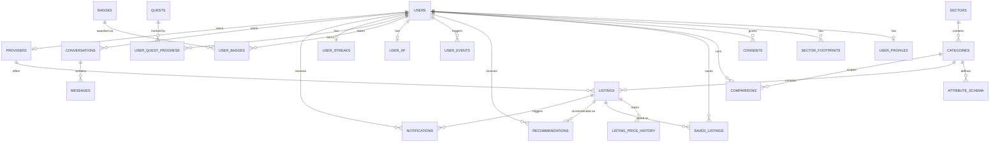

# Kuwana database architecture

29 tables, standard Postgres, no Supabase-specific features. The DDL lives in
[`schema.sql`](./schema.sql) in this same folder — paste-able as-is into a
fresh Supabase project today, or a plain Postgres/RDS/Neon instance later,
with zero changes either way. See that file's header comment for exact
run instructions and how it's kept in sync with `prisma/schema.prisma`
(the versioned source of truth — this file is a generated, human-readable
snapshot of it, verified byte-equivalent against the live database on
2026-08-06).

## Why this is portable

Checked directly against the live Supabase project's `pg_indexes`,
`pg_policies`, `pg_trigger`, `information_schema.routines`, and
`pg_extension`:

- **No Row Level Security** — every table has RLS off, no policies exist.
  Authorization is enforced in the Next.js API layer (Prisma connects with
  the DB's own credentials, not through Supabase's PostgREST/RLS path).
- **No triggers, no stored functions, no views.**
- **No Supabase-only extensions in use** — `pgcrypto`, `uuid-ossp`, and
  `plpgsql` are standard Postgres; `pg_stat_statements` is a generic
  monitoring extension most managed Postgres providers ship; `supabase_vault`
  is present but no table/column here depends on it.
- **No cross-schema foreign key to `auth.users`** — despite an earlier draft
  of this file claiming one, it was never actually applied. `public.users.id`
  is written by the app to match the Supabase Auth user id, but nothing in
  the DB enforces that today. An optional, clearly-marked block at the
  bottom of `schema.sql` adds that FK if you want it while on Supabase —
  skip it when you move elsewhere.

## Table groups

| Domain | Tables |
|---|---|
| Identity & onboarding | `users`, `user_profiles`, `sector_footprints`, `consents` |
| Sector catalog (schema-driven) | `sectors`, `categories`, `attribute_schema`, `providers`, `listings`, `listing_price_history` |
| User activity | `comparisons`, `saved_listings`, `recommendations`, `notifications` |
| AI chat assistant | `conversations`, `messages` |
| Gamification | `user_events`, `gamification_rules`, `user_xp`, `badges`, `user_badges`, `quests`, `user_quest_progress`, `user_streaks` |
| Price/data intelligence | `social_price_mentions` (free social-media scanner, admin-reviewed), `fx_rates` (live currency rates) |
| Platform ops | `admin_audit_log`, `rate_limit_hits` |
| Standalone | `waitlist_signups` (healthcare "coming soon") |

## Entity relationships

`gamification_rules`, `social_price_mentions`, `fx_rates`, `admin_audit_log`,
`rate_limit_hits`, and `waitlist_signups` have no foreign keys — each is a
standalone reference/log table keyed on its own natural or generated key.
`admin_audit_log` in particular deliberately has **no** FK to the rows it
describes (a listing/provider/user it references can be deleted; the log
entry must survive that).

## Two ways to stand this up

**Fresh Supabase project, no repo needed:** Supabase Dashboard → SQL Editor
→ paste `schema.sql` → Run. Then seed reference data (sectors, categories,
providers, listings, gamification rules) with
`DATABASE_URL="<connection string>" npm run db:seed` from this repo.

**From this repo, any Postgres target:** point `DATABASE_URL`/`DIRECT_URL`
at the target and run `npx prisma migrate deploy`, which replays
`prisma/migrations/*/migration.sql` — the actual versioned history
(15 migrations from 2026-08-02 through 2026-08-05). This is the path to
prefer once you're touching the schema again, since it keeps history intact
instead of collapsing it into one script.

Both paths produce an identical schema — confirmed via
`prisma migrate diff` showing zero difference between `prisma/schema.prisma`
and the live database, and by executing `schema.sql` end-to-end in an
isolated scratch schema on the live project (created 29 tables, then
dropped) before this file was written.

## When you rebuild on another platform

Nothing here is Supabase-locked, so the move is mechanical:

1. Run `schema.sql` (or `prisma migrate deploy`) against the new Postgres.
2. Point `DATABASE_URL`/`DIRECT_URL` at it.
3. Skip the commented-out `auth.users` FK block unless the new platform is
   also Supabase.
4. If the new platform isn't Postgres at all, `prisma/schema.prisma` is
   still your source of truth for the data model — Prisma supports MySQL,
   SQLite, SQL Server, and others, but the DDL in `schema.sql` (native
   enums, `JSONB`, GIN index) is Postgres-specific and would need
   translating; the model relationships and constraints would not.
